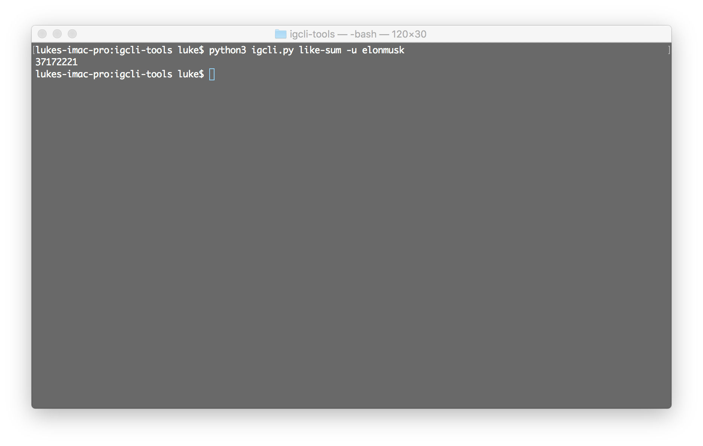

# igcli-tools

[](https://github.com/lukeify/igcli-tools)
[](https://github.com/lukeify/igcli-tools)



Command line application to run various metrics and analysis tools on your, and others, Instagram profiles.

## User Instructions

Follow the instructions below to install this script. Once installed, you can run any of the tools with the following command.

```
python3 igcli.py <toolname> <tooloptions>
```

At present, there are only four functioning tools in the toolkit:

* `like-analysis`. For a given user, calculate the number of likes they have received. Returns the number of likes.
* `hashtag-analysis`. Calculates the number of hashtags the user has used in their captions for their posts; along with a mean, median,
    mode, and most used hashtags.
* `caption-hashtag-count-preview`. For a given caption, return the number of hashtags present within it, and determine if it will successfully post.
* `user-scoreboard`. For a given newline-separated file of usernames, return the users ordered by most posts.

### Prerequisites

Ensure you have Python3 & pip3 installed on your machine. You will also need the `lxml` and `requests` libraries.

### Installation

```
git clone https://github.com/lukeify/igcli-tools
cd igcli-tools
```

### Building

No buildsteps necessary. To run the application, see above.

## Tests

No testing at this point.

## Deployment

New releases will be pushed to GitHub occasionally as features are added.

## Built With

* Python 3 & pip
* `requests` & `lxml` packages

# Contributing

Feel free to make pull requests and open issues. No CONTRIBUTING.md at this stage.

# Versioning

Design & functionality of this site uses [semantic versioning](https://semver.org). Individual posts are outside the scope of versioning.

# Author

Luke Davia.

# Notes

* This tool adheres to PEP8 conventions & style.

# License

The content of this repository is licensed under [The GNU General Public License (GPL) version 3](http://www.gnu.org/licenses/gpl-3.0.html). For more on this license, [read the summary on tldrlegal.com](https://tldrlegal.com/license/gnu-general-public-license-v3-(gpl-3)).

# Acknowledgements

Thanks to Instagram for making my life hell and not providing an API.